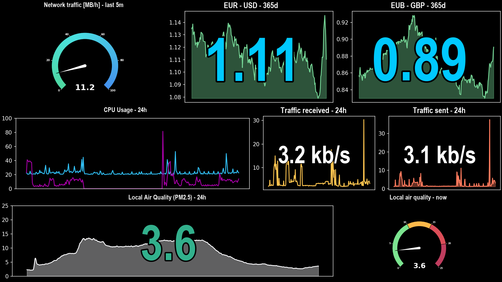
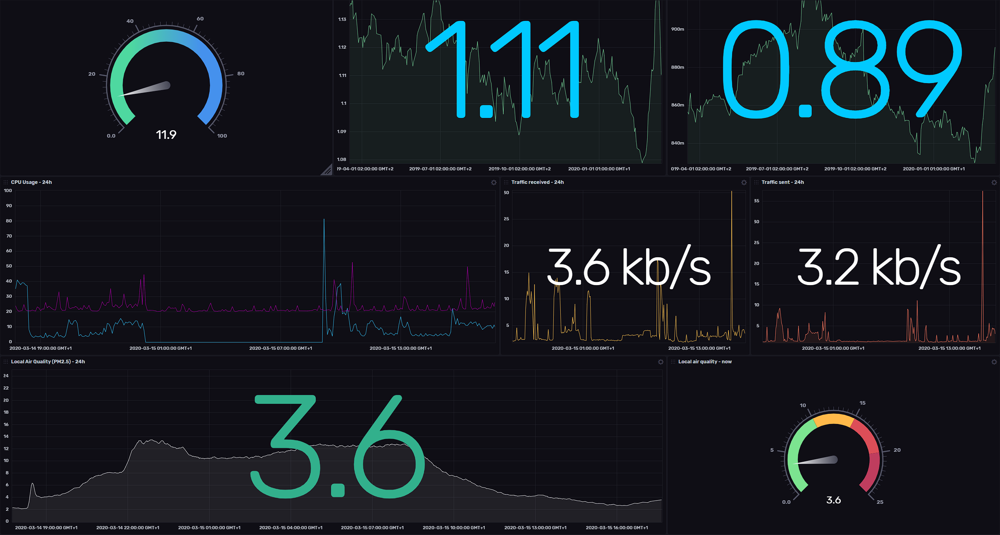

# InfluxDB 2.0 Dashboard Renderer

Code that renders (subset of) InfluxDB 2.0 Dashboards as images.

The first goal of the project is to render dashboards that only use a subset of InfluxDB 2.0 functionality as an image.

The longer term goal is to mimic most views and specifics of InfluxDB 2.0 dashboards to also allow rendering more complex dashboards.

# Example dashboard

Below is an example rendering of a dashboard:



Along with a screenshot of InfluxDB dashboard for comparsison:



# Getting started

## Web server

Run locally without docker:

```bash
$ PYTHONPATH=. ./server/server.py
```

Run locally using docker:

```bash
$ docker build -t influxdb-dashboard-renderer-server .
$ docker run -p 5000:5000 influxdb-dashboard-renderer-server
```

Next, you can invoke the `/render` endpoint to retrieve a ready to use image in PNG format. Such as:

```bash
curl --header "Content-Type: application/json" -X POST \
--data '{
  "url": "(url)",
  "token": "(access token)",
  "org_id": "(organization id)",
  "id": "(dashboard id)",
  "width": 1280,
  "height": 720,
  "dpi": 75
}' http://127.0.0.1:5000/render >image.png
```

Where `(url)` is the URL to the InfluxDB - such as `https://us-west-2-1.aws.cloud2.influxdata.com` for [InfluxDB Cloud](https://www.influxdata.com/products/influxdb-cloud/) US West-2 region.

The `(access token)` should be an all-access token for your organization inside InfluxDB instance, as those are needed to retrieve information about dashboards.

The `(organization id)` and `(dashboard id)` as 16-letter hexadecimal identifiers of the organization and dashboard inside InfluxDB. The identifiers can be extracted from the dashboard view URL, where the URL is `https://hostname/orgs/(organization id)/dashboards/(dashboard id)`.

For more information on building and running the included web server functionality, please check the [server directory][server].

## Python package and rendering outputs manually

Below is minimal code to use the package on its own:

```python
from influxdb_dashboard import InfluxDBClient, InfluxDBDashboardView, InfluxDBDashboardOutput

TOKEN='(your InfluxDB 2.0 token)'
ORG_ID='(your 16 characters org ID)'
LABEL='(label in InfluxDB 2.0 that has a dashboard associated with it)'

c = InfluxDBClient(url='https://eu-central-1-1.aws.cloud2.influxdata.com', token=TOKEN, org=ORG_ID)
d = InfluxDBDashboardView.find_by_label(c, LABEL)

# optionally set timeRangeStart, timeRangeStop and windowPeriod to show last 30 days, using 15 minute windows
d.set_time_range(start_offset=-(30*24*60), end_offset=0, window_period=15, offset_unit='m')

# render to an image - defaults to 1920x1080 pixels image, but this can be customized
o = InfluxDBDashboardOutput(dpi=150, rows=d.height)
img = o.draw(d)
img.save('./image1.png')

# render a black and white image, using white background instead of default black one ; image is suitable for eink displays
o = InfluxDBDashboardOutput(width=1200, height=825, rows=d.height, dpi=150, mode='bw', dark=False)
img = o.draw(d)
img.save('./image-eink.png')
```

# What is currently working

- Basic Flux queries
- Queries that require `v.timeRangeStart`, `v.timeRangeStop` and `v.windowPeriod`
- Graph cells
- Single stat cells
- Graph + single stat cells (with minor caveats regarding centering of single stat relative to graph)
- gauge cells (currently only partially rendering correct content)

# Available output modes

The following table summarizes available options for the `mode` parameter to `InfluxDBDashboardOutput`:

| Mode    | Description                                                                                 |
| ------- | ------------------------------------------------------------------------------------------- |
| `color` | (default) Render the dashboard as regular, color image                                      |
| `bw`    | Render the dashboard using only black and white colors, suitable for 2-color e-ink displays |
| `bw4`   | Render the dashboard using only 4-color grayscale, suitable for 4-color e-ink displays      |
